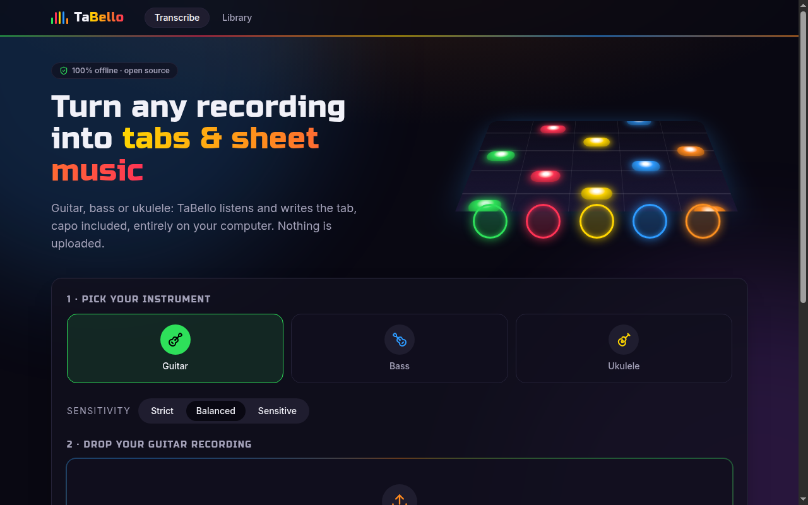
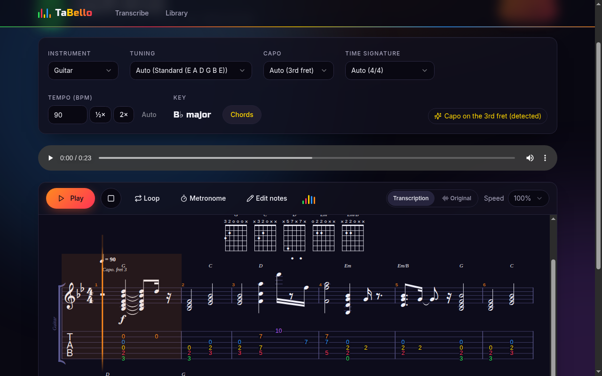
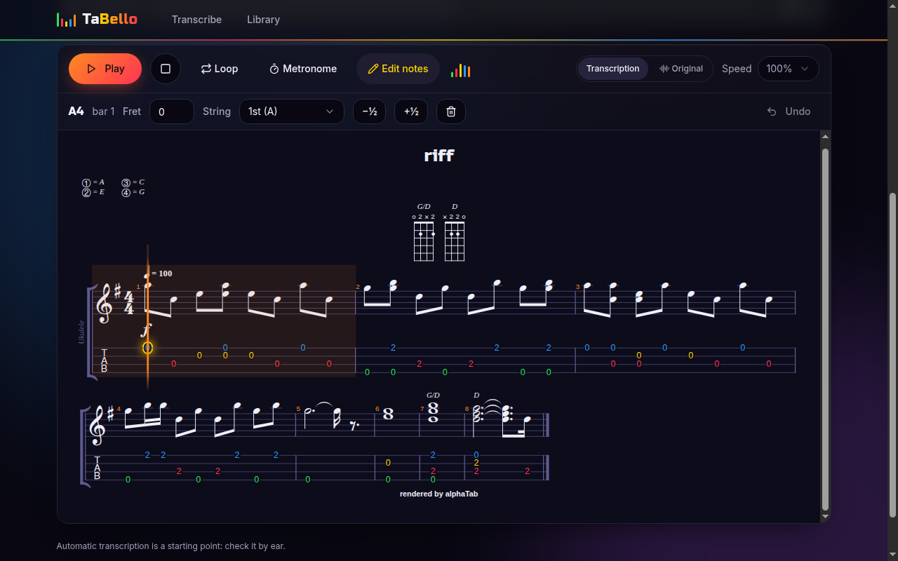

# TaBello

**Turn any recording into guitar, bass or ukulele tabs — entirely on your computer.**

TaBello is a free, open-source desktop app. Give it an audio or video file (a lesson, a live clip, a demo
you recorded) and it listens, detects the notes with a machine-learning model, and writes standard
notation plus tablature you can play back, slow down and export. No account, no upload, no internet
connection needed: your files never leave your machine.



## Features

- **Guitar, bass and ukulele**, with common tunings: standard, drop D, half step down, D standard, DADGAD,
  open G, 5-string bass, and ukulele high G / low G / D tuning / baritone.
- **Automatic detection** of tempo, key, time signature (4/4, 3/4, or a triplet feel for swing and
  shuffle; 6/8 can be chosen by hand), tuning (drop D, half step down, 5-string bass, low-G ukulele)
  and **capo** — every guess can be overridden from a menu, and the score updates instantly.
- **Chord names and diagrams** above the staff, named after the shapes you play (relative to the capo).
- **Playable fingerings**: notes are placed on strings and frets by an optimizer that keeps chord shapes
  compact and hand movement small.
- **Notation + tablature** with synthesized playback, a cursor, a metronome, slow-down and loops.
  Tab numbers are colored by string.
- **Play along with the original recording** (audio or video): the score follows it, and you can loop a
  passage and slow it down without changing its pitch.
- **Edit the tab**: click a note to change its fret, string or pitch, or delete it; undo, or restore
  the detected notes at any time.
- **Export** to Guitar Pro 7 (`.gp` — opens in Guitar Pro, MuseScore, TuxGuitar), MIDI (`.mid`) and alphaTex.
- **Local library** of all your transcriptions.

| Capo and chords detected on a strummed part | Editing a ukulele tab |
| --- | --- |
|  |  |

## Download and install

Installers for Windows, macOS (Apple Silicon) and Linux will be published on the
[Releases page](https://github.com/JackF007/taBello/releases); until the first release, run TaBello
from source (see [Development](#development)). TaBello uses no paid code-signing certificates, so the
first launch of an installed copy needs one extra click:

- **Windows**: on the SmartScreen prompt, click *More info → Run anyway*.
- **macOS**: open the app once, then go to *System Settings → Privacy & Security* and click *Open Anyway*.
- **Linux**: make the AppImage executable (`chmod +x TaBello-*.AppImage`) and run it.

## How to use it

1. **Pick your instrument** (guitar, bass or ukulele).
2. **Drop a file** or click *Choose file*. Most audio and video formats work (MP3, WAV, FLAC, M4A, MP4,
   MOV, MKV…), up to 15 minutes. Transcription takes a few seconds per minute of audio.
3. **Check the result** on the project page:
   - tuning, capo and time signature are detected (*Auto*); pick another value if a guess is wrong;
   - if the tempo looks off by a factor of two, use **½×** or **2×**;
   - press **Play** to hear the transcription, or switch the player to **Original** to hear the
     recording while the cursor follows the score;
   - drag over bars to select them and press **Loop** to practice a passage; lower the **Speed** to
     slow it down (the recording keeps its pitch);
   - turn on **Edit notes** and click a note to fix it: type a fret, use ↑/↓ for semitones, Alt+↑/↓ to
     move it to another string, Delete to remove it, Ctrl+Z to undo. *Restore detected notes* brings
     back the original transcription.
4. **Export** to Guitar Pro or MIDI to keep editing in your favorite program.

Keyboard: Space plays and pauses.

### Getting the best results

Automatic transcription is a starting point, not a finished tab. Accuracy depends a lot on the recording:

- **Solo instrument recordings work best.** In a full band mix, vocals, drums and keys are heard too
  and produce extra or wrong notes.
- **Clean, close recordings beat distant or noisy ones.** Heavy distortion, reverb and effects make
  notes harder to detect.
- **Choose the right instrument before transcribing**: it sets the frequency range the model listens to.
- **Sensitivity**: if you get too many stray notes, try *Strict*; if quiet notes are missing, try
  *Sensitive*.
- **Tuning matters**: drop D, half step down, 5-string bass and low-G ukulele are recognized; for other
  tunings (DADGAD, open G…) select them by hand so the frets come out right.
- **6/8**: TaBello does not guess compound meters; choose 6/8 and set the tempo in dotted quarters.

### Known limitations

- Rhythms are quantized to 16th notes, or to 8th-note triplets in the triplet feel; mixed rhythms
  (triplets inside a straight 4/4) are approximated.
- Playing techniques (bends, slides, hammer-ons, vibrato) are not written yet.
- Only notes can be edited (fret, string, pitch, delete); adding notes and changing rhythms is best done
  after exporting to Guitar Pro, MuseScore or TuxGuitar.
- Very fast passages and dense chords can lose notes; overtones can occasionally add an octave note.
- The tempo is assumed constant over the whole piece.

## How it works

1. **FFmpeg** extracts the audio track and converts it to 22.05 kHz mono.
2. **[Basic Pitch](https://github.com/spotify/basic-pitch-ts)**, Spotify's polyphonic note-detection model,
   runs locally with TensorFlow.js (WebAssembly backend) and lists the notes it hears.
3. TaBello cleans the result: it removes quiet overtones and merges the phantom re-attacks the model
   reports for notes that are still ringing.
4. It estimates the **tempo** (onset periodicity), **key** (Krumhansl–Schmuckler profiles) and **time
   signature** (does the off-beat fit a straight or a triplet grid? do accents and bass notes repeat
   every three or four beats?), then quantizes the notes to that grid with bar lines on the downbeats.
5. It detects the **tuning** and **capo** by comparing how playable the part is under each candidate, and
   chooses strings and frets with a Viterbi search that balances easy shapes against hand movement.
6. It names the **chords** from the notes struck together, and **[alphaTab](https://alphatab.net/)**
   renders the notation, tablature and chord diagrams and plays them back — with its own synthesizer
   or by following the original recording.

Everything runs on your machine; transcription happens in a separate background process so the
window stays responsive.

## Development

Requirements: [Node.js](https://nodejs.org/) 22.12 or newer and Git. On Windows, the
[Microsoft Visual C++ Redistributable](https://learn.microsoft.com/cpp/windows/latest-supported-vc-redist)
is also needed to unpack Electron during `npm install`.

```sh
git clone https://github.com/JackF007/taBello.git
cd taBello
npm install        # also downloads the Electron binary for your OS
npm run dev        # start the app with hot reload
```

| Command | What it does |
| --- | --- |
| `npm run dev` | Run the app in development mode |
| `npm test` | Unit and integration tests (includes a real FFmpeg + Basic Pitch run) |
| `npm run benchmark` | Accuracy benchmark on [GuitarSet](#measuring-accuracy) |
| `npm run test:e2e` | Build, then drive the real app with Playwright |
| `npm run lint` / `npm run typecheck` | ESLint / TypeScript checks |
| `npm run build` | Production build into `out/` |
| `npm run dist` | Build an installer for the current OS into `release/` |

If `npm install` fails on Windows with `Cannot find native binding`, install the Visual C++
Redistributable (`winget install Microsoft.VCRedist.2015+.x64`) and run `npx install-electron`.

### Tech stack

Electron, React, TypeScript, Vite (electron-vite), Tailwind CSS with shadcn/ui, FFmpeg, TensorFlow.js
with Spotify Basic Pitch, alphaTab, @tonejs/midi, Vitest, Playwright and GitHub Actions.

### Architecture

```
┌──────────────────────────── Renderer (React) ────────────────────────────┐
│ Transcribe · Library · Project pages                                     │
│ Music engine (pure TS): tempo, key & meter detection → quantization →    │
│ tuning & capo detection → Viterbi fingering → chord names → alphaTex →   │
│ alphaTab (synth or play-along) · note editing · MIDI/GP export           │
└───────────────▲──────────────────────────────────────────────┬───────────┘
                │ window.tabello.* (typed API via contextBridge)│
┌───────────────┴──────────────── Preload ─────────────────────▼───────────┐
│ Minimal, typed IPC surface — no Node.js in the renderer                  │
└───────────────▲──────────────────────────────────────────────┬───────────┘
                │ ipcRenderer.invoke / progress events          │
┌───────────────┴───────────────── Main process ───────────────▼───────────┐
│ IPC handlers (sender + input validation) · project store (JSON files,    │
│ original notes kept when edited)                                         │
│ app:// protocol (renderer + CSP) · tabello-media:// (original file,      │
│ HTTP range requests) · save dialogs · job manager (one job, cancellable) │
│        └── utilityProcess, one per job:                                  │
│            FFmpeg → 22.05 kHz mono PCM → Basic Pitch (TF.js WASM)        │
│            → overtone filtering + re-attack merging → notes              │
└──────────────────────────────────────────────────────────────────────────┘
```

```
src/
├── main/                 Electron main process
│   ├── index.ts          window, security settings, app lifecycle
│   ├── ipc.ts            IPC handlers (validated)
│   ├── protocols.ts      app:// and tabello-media:// schemes
│   ├── projects.ts       local project library
│   └── transcription/    utility-process worker, FFmpeg + Basic Pitch pipeline
├── preload/              contextBridge API exposed as window.tabello
├── shared/               IPC contract and instrument/tuning presets
└── renderer/             React app
    └── src/lib/music/    detection (tempo, key, meter, tuning, capo, chords), arrangement,
                          note editing, alphaTex/MIDI/GP export
benchmark/                GuitarSet accuracy benchmark
e2e/                      Playwright tests of the desktop app
```

### Design decisions

- **No `fluent-ffmpeg`**: it is deprecated upstream; TaBello spawns the bundled FFmpeg binary directly.
- **WebAssembly instead of `tfjs-node`**: same results, under 1 MB instead of ~390 MB of unmaintained
  native code, and no platform-specific builds. `tfjs-node` was ~3× faster in a benchmark and could
  come back as an optional accelerator.
- **Bundled worker**: only `tfjs-core`, `tfjs-converter` and the WASM backend are shipped (the app
  archive went from 299 MB to 22 MB).
- **alphaTab** renders notation and tablature and plays them back. It cannot import MIDI, so detected
  notes are converted to alphaTex.
- **Measured post-processing**: on a synthetic plucked-string test (riff + strummed chords, 53 notes),
  raw Basic Pitch output has precision 0.48 / recall 0.89; TaBello's thresholds, overtone filtering and
  re-attack merging bring it to 0.83 / 0.85. A regression test guards these numbers.

### Measuring accuracy

[GuitarSet](https://guitarset.weebly.com/) (360 annotated guitar recordings, CC BY 4.0) can be used to
measure TaBello's accuracy. Download and unzip `annotation` and `audio_mono-mic` into one folder, then:

```sh
GUITARSET_DIR=/path/to/GuitarSet npm run benchmark
# optional: GUITARSET_LIMIT=20, GUITARSET_FILTER=solo, GUITARSET_SENSITIVITY=high,
#           GUITARSET_AUDIO=audio_hex-pickup_debleeded (cleaner pickup audio)
```

It reports note precision, recall and F1 (correct pitch, onset within 50 ms) and the share of correctly
detected notes placed on the string the guitarist actually used — both for the whole pipeline and for
the fingering optimizer alone (arranging the annotated notes). Results are also written to
`benchmark/results/`. Please share your numbers in an issue when you change the pipeline.

### Releases

Releases are built for free by GitHub Actions: push a tag matching the version in `package.json`
(e.g. `git tag v0.1.0 && git push origin v0.1.0`) and installers for Windows, macOS and Linux are
attached to a draft GitHub Release. Builds are unsigned (macOS ad-hoc signed); free code signing for
open-source projects such as [SignPath Foundation](https://signpath.org/) can remove the Windows warning.

## Roadmap

Ideas, roughly by priority — contributions welcome:

- [x] Accuracy benchmark tool for [GuitarSet](https://guitarset.weebly.com/) (publish baseline numbers)
- [x] Play along with the original recording: synced cursor, A–B loop, slow-down without pitch change
- [x] Detect drop D, half step down, 5-string bass and low-G ukulele
- [x] Chord names and chord diagrams
- [x] Triplets, swing, 3/4 and 6/8
- [x] Edit notes directly in the tab
- [ ] Tune thresholds and fingering costs on GuitarSet
- [ ] Optional source separation to isolate the guitar or bass from a full mix
- [ ] Detect recordings tuned off A = 440 Hz (e.g. 432 Hz) from pitch bends
- [ ] Write techniques: bends, slides, hammer-ons, pull-offs, vibrato
- [ ] Tempo changes within a piece
- [ ] Add notes and change rhythms in the editor

## Contributing

Bug reports, transcription examples and pull requests are welcome; see [CONTRIBUTING.md](CONTRIBUTING.md).
For a transcription that came out wrong, a short clip (a few seconds) plus the settings you used helps most.

## License

TaBello is free software: you can redistribute it and/or modify it under the terms of the
[GNU General Public License v3.0 or later](LICENSE).

It builds on many open-source projects — FFmpeg (GPL-3.0), Spotify Basic Pitch and TensorFlow.js
(Apache-2.0), alphaTab (MPL-2.0), Electron and React (MIT), and fonts under the SIL Open Font License.
See [THIRD_PARTY_NOTICES.md](THIRD_PARTY_NOTICES.md) for the full list and their licenses.
